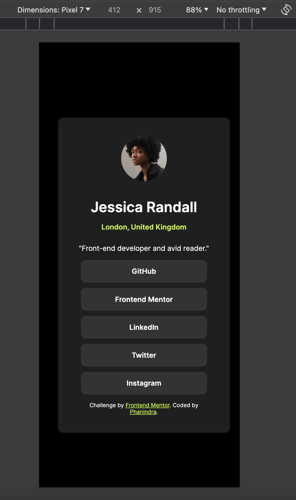

# Frontend Mentor - Social links profile solution

This is a solution to the [Social links profile challenge on Frontend Mentor](https://www.frontendmentor.io/challenges/social-links-profile-UG32l9m6dQ). Frontend Mentor challenges help you improve your coding skills by building realistic projects.

## Table of contents

- [Overview](#overview)
    - [The challenge](#the-challenge)
    - [Screenshot](#screenshot)
    - [Links](#links)
    - [Built with](#built-with)
- [Author](#author)

**Note: Delete this note and update the table of contents based on what sections you keep.**

## Overview

### The challenge

Users should be able to:

- See hover and focus states for all interactive elements on the page

## Screenshot
### Desktop

### Mobile

### Links

- Solution URL: [Github Link](https://github.com/phanindra28/social-links-profile-frontend-mentor)
- Live Site URL: [Live site URL](https://phanindra28.github.io/social-links-profile-frontend-mentor/)

### Built with

- HTML
- CSS custom properties
- Github

## Author

- Website - [Add your name here](https://www.your-site.com)
- Frontend Mentor - [@phanindra28](https://www.frontendmentor.io/profile/phanindra28)
